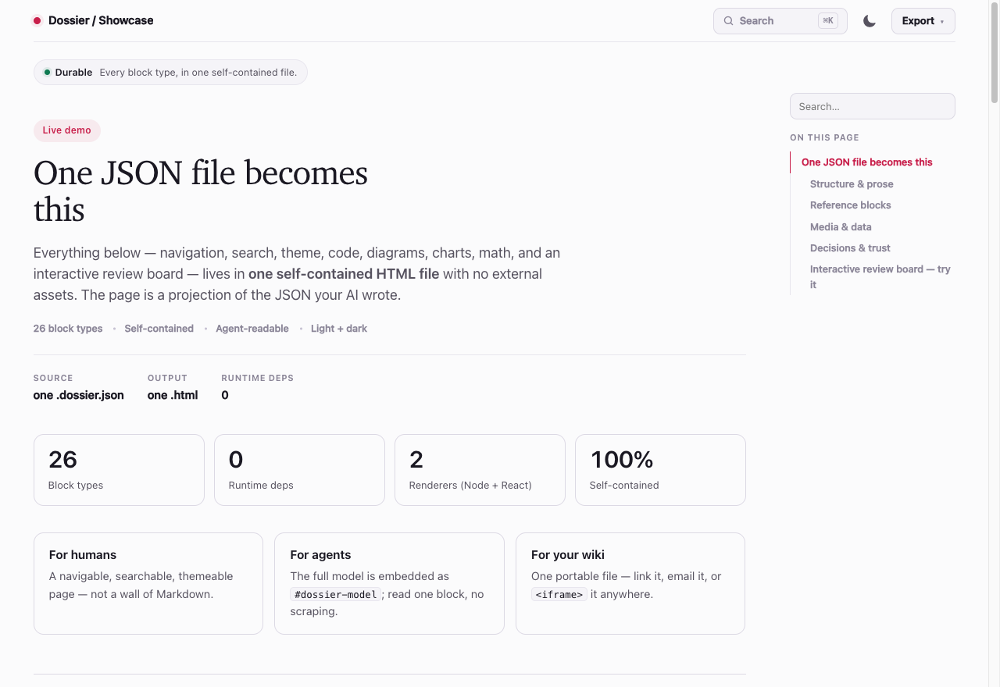

<div align="center">

# Dossier

### Stop asking your AI for a Markdown file. Have it build you a Dossier: a self-contained, interactive HTML document for planning, documenting, deciding, and doing *with* AI.

[](LICENSE)
[](#requirements)
[](#how-it-works)
[](#how-it-works)
[](#)
[](https://mrbagels.github.io/dossier/)

<a href="https://mrbagels.github.io/dossier/"></a>

**[See the live demo &rarr;](https://mrbagels.github.io/dossier/)** &nbsp;Every block type, in one self-contained file.

</div>

When you ask an AI to "write up a plan," "lay out the options," or "run this
implementation through a real review loop," it usually dumps a wall of Markdown. Dossier
replaces that. Your agent builds you **one self-contained, interactive HTML page** you can
navigate, search, mark up, and hand back to the AI to act on.

```
  "write me a markdown file"   →   a flat .md you skim once and lose
  "make me a dossier"          →   one interactive .html: navigable, markable, agent-readable
```

Built for the back and forth that real AI-assisted work needs:

- **Your agent writes it.** Plans, specs, research, implementation packets, reviews, and
  options, as a structured document instead of a text dump. You hand-write nothing.
- **You work in it.** Navigate, search, expand the details that matter, tick the options you
  want, leave notes, and edit text in place.
- **You hand it back.** Export your decisions as JSON and the agent implements them. The
  document carries its own structured data, so the AI reads it back exactly. No scraping, no
  lossy copy-paste.

One file. No server, no external assets, works offline. Open it, email it, or embed it.

## Get started

Let your **agent** drive it. Install the CLI and the skill once:

```bash
npm install -g github:mrbagels/dossier                 # one line, any platform (Node 18+)
ln -s "$(pwd)/dossier/skill" ~/.claude/skills/dossier  # if cloned; see "Use it from an agent"
```

Then ask your assistant:

> *"Make me a dossier planning the Q3 migration."*
> *"Make me an implementation dossier for this refactor."*
> *"Turn these five options into a review board I can triage."*

It writes a `*.dossier.json`, runs `dossier build`, and you get `my-doc.html` (+ `.md`).

Driving it yourself:

```bash
dossier init my-doc                # scaffold my-doc.dossier.json from a starter
dossier build my-doc.dossier.json  # writes my-doc.html (+ .md)
open my-doc.html                   # Linux: xdg-open, Windows: start
```

<div align="center">

---

**Documentation**

[How it works](#how-it-works) · [From an agent](#use-it-from-an-agent) ·
[Authoring](#authoring) · [Block types](#block-types) · [Review / triage](#review--triage) ·
[Process dossiers](#process-dossiers) · [React](#react) · [Plugins & CLI](#plugins--cli) ·
[Embedding](#embedding) · [Development](#development)

---

</div>

## How it works

The page you open is a projection of one JSON model (which the agent writes). The full model
is embedded back into the file as a `#dossier-model` island, which is what an agent reads.
Everything else is inlined at build time, so the result needs nothing at view time:

```
my-doc.dossier.json ──► enrich ──► render ──► self-contained .html  (+ .md, + agent digest)
                         │                     │
                         │                     └─ <script id="dossier-model"> ← the source model
                         ├─ Shiki: code → highlighted HTML (light/dark via CSS variables)
                         └─ Graphviz WASM: DOT → inline SVG
```

- **Zero runtime dependencies in the output.** Shiki (highlighting), Graphviz-WASM
  (diagrams), KaTeX (math), and React (the optional port) run at build time only. None ship
  to the viewer.
- **One design system.** Tokens, the inlined client runtime, and the HTML shell are shared by
  both renderers (`renderShell()`).
- **It round-trips.** Edit the JSON, rebuild, and the island always deserializes back to the
  exact model. The human-and-agent loop stays lossless.

Each page includes a sticky table of contents with scroll-spy, in-page search, a command
palette, light/dark theme, reading progress, per-block copy, heading anchors, collapsible
sections, glossary tooltips, in-place text editing, and one-click export to Markdown, JSON,
or agent digest. All inlined, all offline, responsive to mobile.

## Use it from an agent

Dossier ships a [Claude Code](https://claude.com/claude-code) skill in [`skill/`](skill/), so
an agent reaches for it whenever you ask for a plan, implementation packet, review,
write-up, report, or options to decide on. Link it into your skills directory:

```bash
ln -s "$(pwd)/skill" ~/.claude/skills/dossier
```

It bundles a [block cheatsheet](skill/references/blocks.md) and a
[starter template](skill/references/starter.dossier.json), and tells the agent to author a
`*.dossier.json` and run `dossier build`. After that, "make me a dossier" is all you need.

### Any agent, via MCP

`dossier mcp` runs a [Model Context Protocol](https://modelcontextprotocol.io) server over
stdio, so any MCP-capable agent can drive Dossier, including the full human-and-agent loop.
Tools: `dossier_render`, `dossier_validate`, `dossier_read_decisions` (read back the options a
human selected on a review board), `dossier_read_process` (read process-board verdicts and
notes), `dossier_get_schema`, `dossier_get_starter`.

```jsonc
// e.g. an MCP client config
{ "mcpServers": { "dossier": { "command": "dossier", "args": ["mcp"] } } }
```

## Authoring

You normally let the agent write this, but the model is small. A dossier is
`{ dossierVersion, kind, meta, blocks[] }`:

```json
{
  "dossierVersion": "1.0",
  "kind": "dossier",
  "meta": { "title": "My title", "slug": "my-doc", "status": "review", "updated": "2026-06-26" },
  "blocks": [
    { "type": "hero", "eyebrow": "Kicker", "title": "Headline", "lede": "One-sentence summary." },
    { "type": "section", "title": "Details", "blocks": [
      { "type": "callout", "tone": "tip", "title": "Note.", "body": "Sections nest other blocks." }
    ] }
  ]
}
```

- **`kind`**: `reader | plan | review-board | dossier | adr | runbook | research |
  comparison | implementation | review | debug | integration-loop | release | incident`.
  Selects defaults and starter shape.
- **`meta`**: `title` (required), `slug`, `eyebrow`, `lede`, `crumbs`, `status`, `owner`,
  `updated`, `version`, `tags`, `baseUrl` (for hosted cross-links), `theme` (token overrides),
  `lifecycle`, `changelog`.
- **`blocks`**: ordered. `section`, `two-col`, and `tabs` nest other blocks. Text fields take
  inline markdown: `**bold**`, `` `code` ``, `[label](url)`, `[[slug]]` cross-document links,
  and `[[Term]]` glossary tooltips.

Full contract: [`schema/dossier.schema.json`](schema/dossier.schema.json).

## Block types

27 built-in, plus your own (see [plugins](#plugins--cli)). Every one has a copy-paste JSON
example in [`skill/references/blocks.md`](skill/references/blocks.md):

| Group | Blocks |
|---|---|
| **Structure** | `hero`, `section`, `two-col`, `tabs`, `prose` |
| **At a glance** | `summary-cards`, `stat-strip`, `flow`, `timeline`, `callout` |
| **Reference** | `table`, `code` (Shiki), `diagram` (DOT or Mermaid to SVG), `references`, `faq`, `glossary` |
| **Media & data** | `figure` (inlined), `math` (KaTeX to MathML), `chart` (bar/line/area SVG), `footnotes` |
| **Decisions, process & trust** | `decision-matrix`, `risk-register`, `assumptions`, `action-items`, `review-board`, `process-board`, `receipt` |

## Review / triage

Deciding *with* AI happens here. Use one `review-board` block for "here are the options,
let's decide." Each candidate is an expandable row: collapsed it's scannable (title, summary,
chips, status, a checkbox); expanded it shows the full reference the agent loaded (`body`
markdown and/or nested `blocks`) plus a notes field.

You filter, search, tick what to do, and write notes, then export a decisions JSON (re-import
to resume). The agent reads the reference plus your decisions and implements them. The human
to agent loop, in one file.

## Process dossiers

Planning is one process. Dossier now also scaffolds process-oriented starters for the actual
work loop:

| Starter | Use it for |
|---|---|
| `plan` | Strategy, options, tradeoffs, and selected direction. |
| `implementation` | Code-editing context, work items, patch preview, verification, and handoff. |
| `review` | Findings, severity, evidence, accepted fixes, and follow-up work. |
| `debug` | Reproduction, hypotheses, fix candidates, and verification. |
| `integration-loop` | Producer/consumer dependency dogfooding and packet exchange. |
| `release` | Release readiness, checks, risks, approvals, and closeout. |
| `incident` | Timeline, mitigation decisions, evidence, and follow-ups. |

They use the existing block catalog plus the dedicated `process-board` block for work items,
verdicts, notes, process JSON export/import, and MCP readback. Follow-on process blocks for
patchsets, diffs, embedded editors, verification runs, and process receipts are tracked in
[`docs/product/process-dossiers/process-dossiers-scope.md`](docs/product/process-dossiers/process-dossiers-scope.md).

## React

Dossier also ships as typed React/TSX components ([`react/`](react/),
`@mrbagels/dossier-react`), for teams that render the same design from a React or Next app.

```ts
import { renderDossier } from "@mrbagels/dossier-react";
const { html, md } = await renderDossier(model);   // the same self-contained file
```

```tsx
// or render blocks live inside an app (optional Motion entrance when hydrated)
import { DossierDocument } from "@mrbagels/dossier-react";
<DossierDocument model={model} animate />
```

The `<Block>` dispatcher covers all 27 block types and reuses the core's CSS, runtime, and
enrichment, so SSR output matches the Node generator. See [`react/README.md`](react/README.md).

## Plugins & CLI

Add custom block types without forking. A plugin registers a renderer:

```bash
dossier build my.dossier.json --plugin ./my-plugin.mjs
```
```js
// my-plugin.mjs; the default export receives the authoring API
export default function ({ registerBlock, esc }) {
  registerBlock("badge-row", (b) =>
    `<section class="ds-block" data-block="badge-row"><div class="ds-chips">` +
    (b.badges || []).map((x) => `<span class="ds-chip">${esc(x)}</span>`).join("") +
    `</div></section>`);
}
```

The same plugin can also `registerComponent(type, Component)` for the React port, so one
plugin reaches full parity across both renderers (the Node renderer is the fallback
otherwise). See [`examples/plugins/badge-row.plugin.mjs`](examples/plugins/badge-row.plugin.mjs).

The full CLI:

| Command | What it does |
|---|---|
| `dossier init [name] --kind <kind>` | scaffold from a starter (`dossier`, `plan`, `implementation`, `review`, `debug`, `integration-loop`, `release`, `incident`, `adr`, `runbook`, `postmortem`, `review-board`) |
| `dossier build <file> [--watch] [--plugin a,b]` | validate and render to `<slug>.html` (+ `.md`) |
| `dossier serve <file> [--open] [--port]` | build and live-reload dev server |
| `dossier validate <file>` | check a model without rendering |
| `dossier diff <old> <new>` | structural diff between two versions |
| `dossier catalog <dir>` | index a folder of dossiers, with a link graph |
| `dossier export <file> --format docx\|md\|pdf` | export to Word, Markdown, or PDF |
| `dossier mcp` | run the MCP server (stdio) |

### Optional: Mermaid and PDF

DOT diagrams, syntax highlighting, math, charts, and Word export (with charts and diagrams
embedded as images) all work out of the box. Two features render through a headless browser
and are opt-in: Mermaid diagrams (`format: "mermaid"`) and `dossier export --format pdf`. To
keep the install lightweight, Playwright and the mermaid library are **not bundled**. Add them
when you want those features:

```bash
npm i playwright mermaid && npx playwright install chromium
# installed Dossier globally? use: npm i -g playwright mermaid && npx playwright install chromium
```

Until then, Mermaid diagrams render as their source (the build prints how to enable it) and
PDF export tells you what to install. Word export needs no browser.

## Embedding

Every page is a complete, style-isolated HTML document, so it embeds anywhere:

```html
<iframe src="my-doc.html" style="width:100%;height:80vh;border:0"></iframe>
```

Cross-link dossiers with `[[other-slug]]`: a relative file link when they sit together, or an
absolute URL when you set `meta.baseUrl` for a hosted site. Dossier is a *companion* to your
docs site, not a replacement.

## Development

```
src/            zero-dependency Node generator (generate.mjs, theme, runtime, renderers)
react/          typed React/TSX port (SSR + live components)
schema/         dossier.schema.json, the document contract
skill/          Claude Code skill (SKILL.md + references + starter)
examples/       sample.dossier.json, showcase.dossier.json
docs/DESIGN.md  the design system and decisions
```

```bash
git clone https://github.com/mrbagels/dossier.git && cd dossier
npm install && npm link
dossier build examples/sample.dossier.json && open examples/dossier-overview.html

cd react && npm install
npx tsx src/cli.tsx ../examples/sample.dossier.json && npx tsc --noEmit
```

## Requirements

Node.js >= 18 to build. The generated pages need only a browser.

## Contributing

Issues and PRs welcome. Keep the output self-contained (no view-time network) and keep one
accent in the design.

When you add a block type, update all of: the Node renderer (`src/generate.mjs`), the React
component (`react/src/blocks.tsx`), the schema (`schema/dossier.schema.json`), the validator
(`src/validate.mjs`), the cheatsheet (`skill/references/blocks.md`), the live demo
(`examples/showcase.dossier.json`), and a test. CI and the
[Pages demo](https://mrbagels.github.io/dossier/) redeploy automatically on push to `next`.

## License

[MIT](LICENSE). Do whatever you want with it.
