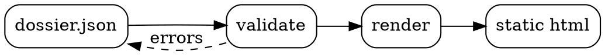

# Every component, one artifact

A working catalog of every Dossier block and its variants, rendered from one `*.dossier.json` model. Use it to design against the real product surface, not a mockup.

## Structure & prose

Containers and long-form text: prose, nested sections, two-col, tabbed panes.

## Authoring long-form copy

Prose blocks carry the connective narrative between heavier components. They accept inline markdown so you can emphasize a **decision**, reference a `config.flag`, or point at the [block catalog](https://example.com/blocks) without leaving the flow.

Use them to set context before a table or chart, then summarize the takeaway after. A single prose block can hold several paragraphs, which keeps related thoughts together instead of fragmenting them across cards.

They also render lists cleanly:

- **Scannable** beats dense: short lines win in a design lab.
- Inline `code` stays legible against the body text color.
- Links such as [the schema](https://example.com/schema) keep their accent treatment.

Close with a plain paragraph so the reader returns to the baseline rhythm before the next block.

## Framed nested section

A bordered container that groups a callout and a table at one level of depth.

> **Containers can nest.** This callout lives inside a framed `section`. The frame draws a hairline border so grouped content reads as one unit.

### Container blocks at a glance

| Block | Nests? | Typical use |
| --- | --- | --- |
| section | Yes | Group related blocks under a heading |
| two-col | Yes | Place two stacks side by side |
| tabs | Yes | Swap between alternate views |
| prose | No | Narrative connective text |


## Unframed nested section

Same container, no border: useful when you want grouping without a visible box.

An unframed section keeps the title and spacing semantics but drops the border. It is the right choice when nested content already has its own visual weight, like the stat strip below, and an extra frame would feel heavy.

**3** Container types · **2** Frame states · **n** Nesting depth


## Left column

The two-col block places two independent stacks side by side. Each column nests its own blocks, so the left side can carry narrative while the right side carries structured detail.

> **Pairing tip.** Lead with prose on the left, then back it with a concrete artifact on the right.

### Balance

Keep columns roughly equal in height for a clean grid.

### Reflow

Columns stack vertically on narrow viewports.


```json
{
  "type": "two-col",
  "left": [],
  "right": []
}
```


### Overview

## What tabs are for

Tabs swap between alternate views of the same idea without lengthening the page. Each tab nests a different kind of block, so a reader can move from **narrative** to **data** to **code** at their own pace.

### Data

### Tab payloads

| Tab | Block inside | Why |
| --- | --- | --- |
| Overview | prose | Set the framing |
| Data | table | Show the structured detail |
| Code | code | Show the literal shape |

### Code

```ts
const tabs = {
  type: "tabs",
  tabs: [
    { label: "Overview", blocks: [] },
    { label: "Data", blocks: [] },
    { label: "Code", blocks: [] },
  ],
};
```


## At a glance

Scannable summaries: summary cards, KPI stats, flow, timeline, callouts.

### Scope

One package, zero runtime deps. Authored as JSON, shipped as a single self-contained `.html` file.

### For humans

Reads like a polished brief. Skim the cards, scan the stats, follow the flow.

### For agents

An embedded `dossier-model` island carries the source of truth for round-tripping edits.

### On track

Catalog parity reached across the CLI and React renderers. All snapshots **green**.

### Watch

Mermaid diagrams need Playwright at build time, otherwise they fall back to source.

### Blocking

Legacy exports still emit the old `delta` shape. Migrate before the next release.


**38** Block types · **0** Runtime deps · **1** Output file · **6** Card tones · **99.4%** Snapshot parity

### How a dossier ships

1. **Author**, Write the document as a `dossier.json` model with typed blocks.
2. **Validate**, Run the schema check so every block uses only documented fields.
3. **Generate**, Build a single self-contained HTML artifact plus the Markdown source.
4. **Hand off**, Share the file. An agent reads the embedded model and applies edits back.

### Release roadmap

- **Foundation** (done), Schema, runtime, and the core block catalog landed.
- **Process packets** (in-progress), Interactive boards, gates, and round-trip export shipping now.
- **React parity** (planned), Bring every block to the React renderer at full fidelity.
- **Public docs site** (blocked), Held until the legacy `delta` export format is retired.

> **Heads up** Every text field accepts inline markdown, so `code`, **bold**, and [links](https://example.com) all render.

> **Verified** The full snapshot suite passed on the release branch. No visual regressions detected.

> **Mind the build step** Mermaid diagrams only rasterize when Playwright is installed. Without it, the source is shown instead.

> **Breaking change ahead** The old export shape is deprecated. Consumers reading the legacy format will break after the next major.

> **Pro tip** Give collection items stable kebab-case ids so exported decisions and edits stay addressable across runs.


## Reference

Tables, code, editable code, FAQ, sources, glossary.

### Block ownership (text columns)

| Block | Owner | Status | Notes |
| --- | --- | --- | --- |
| table | Kyle | Stable | Hairline rows, header is **bold** |
| code | Kyle | Stable | Shiki highlights at build time |
| code-editor | Agent | Beta | Round-trips as an `edits` packet |
| faq | Docs | Stable | Accordion, one open at a time |
| glossary | Docs | Stable | Resolves `[[Term]]` tooltips elsewhere |

### Render timings by block (numeric alignment)

| Block | Count | Avg ms | P95 ms | Bytes |
| --- | --- | --- | --- | --- |
| table | 128 | 0.42 | 1.10 | 2048 |
| code | 64 | 3.80 | 12.40 | 16384 |
| code-editor | 12 | 5.05 | 18.90 | 8192 |
| faq | 240 | 0.18 | 0.55 | 1024 |
| glossary | 96 | 0.21 | 0.70 | 1536 |

```ts
import { z } from "zod";

export const SessionSchema = z.object({
  token: z.string().min(1),
  expiresAt: z.number().int(),
});

export type Session = z.infer<typeof SessionSchema>;

export function readSession(raw: unknown): Session | null {
  const result = SessionSchema.safeParse(raw);
  return result.success ? result.data : null;
}
```

```bash
#!/usr/bin/env bash
set -euo pipefail

npm ci
npm test
npm run build

VERSION="$(node -p "require('./package.json').version")"
echo "Publishing dossier@${VERSION}"
npm publish --access public
```

## Editable runtime config

Bounded source text that can be edited in place and exported as an edits packet.

```json
{
  "theme": "auto",
  "inlineAssets": true,
  "maxBlocks": 512,
  "highlight": {
    "engine": "shiki",
    "theme": "github-dark"
  }
}

```


### Reference blocks, common questions

**Do tables support markdown inside cells?**

Yes. Cell text accepts inline markdown such as **bold**, `code`, and [links](https://example.com).

**How is a `code` block highlighted?**

Shiki runs at build time, so the artifact stays self-contained with no runtime highlighter dependency.

**What does a `code-editor` block export?**

Local edits round-trip as a `dossier.edits/v1` packet keyed by block id, with `text`, `lang`, and `targetPath`.

**Where do glossary terms get used?**

A `glossary` block defines terms that resolve `[[Term]]` tooltips anywhere else in the document.


| Source | Signal | Use |
| --- | --- | --- |
| Shiki syntax highlighter | Authoritative source for supported languages and themes | Pick `lang` values that Shiki recognizes for `code` blocks |
| Zod validation | Boundary validation patterns used in the TypeScript sample | Mirror `safeParse` for parsing untrusted input |
| JSON Schema spec | Defines the contract enforced by `dossier.schema.json` | Validate dossier documents before publishing |

### Glossary

- **dossier-model**: The embedded source-of-truth JSON island that every block is rendered from.
- **edits-packet**: A `dossier.edits/v1` export produced by `code-editor` blocks, keyed by block id.
- **block-type**: The required `type` field on every block that selects its renderer and schema.
- **inline-asset**: A local image or font inlined as a data URI so the artifact stays fully self-contained.


## Code review

Proposed patches and unified-diff review surfaces.

## Patch review surfaces

Two block families drive code review. The **patch-set** records proposed edit packets with `operation`, `status`, and `risk`, plus files, work items, verification, and an optional unified diff. The **diff-view** parses a unified diff into a file-first reviewable surface. Below each enum value appears at least once so every chip and badge renders.

## Auth refactor patch set

### Add token store module

Introduce a narrow `tokenStore` helper so persistence is no longer read inline.

- **Operation:** add
- **Status:** proposed
- **Risk:** low
- **Files:** src/auth/token-store.ts
- **Work items:** g4-extract-token-store
- **Verification:** npm test -- token-store

```diff
diff --git a/src/auth/token-store.ts b/src/auth/token-store.ts
new file mode 100644
--- /dev/null
+++ b/src/auth/token-store.ts
@@ -0,0 +1,9 @@
+const KEY = "session.token";
+
+export const tokenStore = {
+  read(): string | null {
+    return localStorage.getItem(KEY);
+  },
+  write(token: string): void {
+    localStorage.setItem(KEY, token);
+  },
+};
```


### Route session reads through the store

Replace the inline `localStorage` read in `readSession` with `tokenStore.read()`.

- **Operation:** modify
- **Status:** accepted
- **Risk:** medium
- **Files:** src/auth/session.ts
- **Work items:** g4-extract-token-store
- **Verification:** npm test -- auth, npm run typecheck

```diff
diff --git a/src/auth/session.ts b/src/auth/session.ts
--- a/src/auth/session.ts
+++ b/src/auth/session.ts
@@ -1,6 +1,7 @@
-export function readSession() {
-  const token = localStorage.getItem("session.token");
-  if (!token) return null;
+import { tokenStore } from "./token-store";
+
+export function readSession() {
+  const token = tokenStore.read();
+  if (!token) return null;
   return decode(token);
 }
```


### Delete legacy cookie shim

Remove the unused `cookie-shim.ts` fallback now that every caller uses the store.

- **Operation:** delete
- **Status:** needs-revision
- **Risk:** high
- **Files:** src/auth/cookie-shim.ts
- **Work items:** g4-retire-cookie-path
- **Verification:** npm test -- auth, grep -r cookie-shim src

```diff
diff --git a/src/auth/cookie-shim.ts b/src/auth/cookie-shim.ts
deleted file mode 100644
--- a/src/auth/cookie-shim.ts
+++ /dev/null
@@ -1,6 +0,0 @@
-// Deprecated: pre-store cookie fallback.
-export function readCookieToken() {
-  const match = document.cookie.match(/session=([^;]+)/);
-  return match ? match[1] : null;
-}
```


### Rename session helper file

Rename `session.ts` to `session-reader.ts` to match the single-responsibility naming.

- **Operation:** rename
- **Status:** applied
- **Risk:** low
- **Files:** src/auth/session.ts, src/auth/session-reader.ts
- **Work items:** g4-tidy-naming

### Add refresh flow and prune old guard

Mixed packet: adds `refresh.ts`, edits `session.ts`, and drops a dead guard branch.

- **Operation:** mixed
- **Status:** skipped
- **Risk:** medium
- **Files:** src/auth/refresh.ts, src/auth/session.ts
- **Work items:** g4-token-refresh
- **Verification:** npm test -- refresh


## Full multi-file diff

Standalone unified diff for file-first review: an added file, a deleted file, and a modified hunk.

src/auth/token-store.ts (+6/-0), src/auth/cookie-shim.ts (+0/-4), src/auth/session.ts (+2/-2)

```diff
diff --git a/src/auth/token-store.ts b/src/auth/token-store.ts
new file mode 100644
--- /dev/null
+++ b/src/auth/token-store.ts
@@ -0,0 +1,6 @@
+const KEY = "session.token";
+export const tokenStore = {
+  read: () => localStorage.getItem(KEY),
+  write: (t: string) => localStorage.setItem(KEY, t),
+  clear: () => localStorage.removeItem(KEY),
+};
diff --git a/src/auth/cookie-shim.ts b/src/auth/cookie-shim.ts
deleted file mode 100644
--- a/src/auth/cookie-shim.ts
+++ /dev/null
@@ -1,4 +0,0 @@
-export function readCookieToken() {
-  const m = document.cookie.match(/session=([^;]+)/);
-  return m ? m[1] : null;
-}
diff --git a/src/auth/session.ts b/src/auth/session.ts
--- a/src/auth/session.ts
+++ b/src/auth/session.ts
@@ -1,7 +1,7 @@
-import { readCookieToken } from "./cookie-shim";
+import { tokenStore } from "./token-store";
 
 export function readSession() {
-  const token = readCookieToken();
+  const token = tokenStore.read();
   if (!token) return null;
   return decode(token);
 }
```


## Media & data

Figures, math, charts, diagrams, footnotes.

## Reading the figures

Every visual in this family is **self-contained**: figures inline as data URIs, charts and diagrams render to SVG at build time, and math compiles to MathML with no external fonts. The throughput numbers below are sampled from a single release window [^g5-sampling], so treat the absolute values as illustrative rather than a benchmark [^g5-method].


### Render pipeline (DOT)




## Decisions

Matrices, risks, assumptions, actions, triage, gates, decision log.

### Where the triage queue lives

| Option | Setup cost | Latency | Cross-team access |
| --- | --- | --- | --- |
| Embedded SQLite | Low | Fast | Limited |
| Managed Postgres | Medium | Fast | Broad |
| Spreadsheet sync | High | Slow | Broad |

### Risk register

| Risk | Likelihood | Impact | Mitigation |
| --- | --- | --- | --- |
| Owner field left blank on import | low | low | Default to the triage rotation lead. |
| Stale candidates never re-reviewed | medium | low | Auto-flag rows untouched for 30 days. |
| Schema drift between board and export | low | high | Pin the export schema and add a contract test. |
| Reviewers disagree on severity scale | medium | medium | Publish a one-page rubric with worked examples. |
| Scope creep during the freeze window | high | high | Freeze the matrix criteria first, then queue new options for the next cycle. |
| Export packet grows past the inline budget | high | medium | Lazy-load reference `blocks` only when a row expands. |

### Assumptions and open questions

- (assumption/unverified) Reviewers will tick decisions in a single sitting per cycle.
- (assumption/verified) The exported decisions JSON round-trips back into the board without loss.
- (assumption/rejected) A shared severity rubric removes most disagreement.
- (open-question/unverified) Should rejected candidates stay searchable or move to an archive view?
- (open-question/verified) Do we need per-candidate audit history, or is the latest verdict enough?
- (open-question/rejected) Can we drop the legacy `priority` import field entirely?

### Triage follow-ups

- [ ] Publish the severity rubric to the team wiki (@Kyle)
- [ ] Wire the decisions export into the nightly sync (@agent)
- [x] Backfill owners on the 12 unassigned rows (@Priya)
- [ ] Add a contract test for the export schema (@agent)

## Candidate triage

### Saved filter views (shipped)

Let reviewers pin a named filter and reopen it later.

Reviewers repeatedly rebuild the same `status:open severity:high` filter. A **saved view** stores the active query, sort, and column set under a name.

Views are local-first and sync opportunistically, so an offline reviewer never loses their pinned queries.

- **Default views:** Mine, High severity, Stale
- **Storage:** localStorage + sync

### Bulk verdict apply (in-review)

Apply one verdict to every selected row at once.

Selecting a range and choosing **Approve** writes the same verdict and an optional shared note to each row, then logs them individually in the export packet so the audit trail stays per-candidate.

```ts
export function applyBulk(ids: string[], verdict: Verdict, note?: string) {
  return ids.map((id) => ({ id, verdict, notes: note ?? "" }));
}
```

> **Audit note.** Each row still exports independently so blame stays precise.

- **Max selection:** 200 rows
- **Undo window:** 10s

### Inline severity rubric (proposed)

Show the scoring rubric next to the severity control.

Disagreement on severity comes from reviewers guessing the scale. A hover card surfaces the **rubric** with one worked example per level so scoring stays consistent.

### Severity rubric

| Level | Trigger | Example |
| --- | --- | --- |
| High | User-facing data loss | Verdicts dropped on export |
| Medium | Degraded but recoverable | Slow filter on large queues |
| Low | Cosmetic or internal | Misaligned chip spacing |

| Source | Signal | Use |
| --- | --- | --- |
| Internal scoring guide | Defines the shared scale | Link from the hover card |
| Prior triage retro | Where disagreement surfaced | Background context |

- **Surface:** Hover card
- **Owner:** Quality guild

### Archive rejected rows (deferred)

Move rejected candidates out of the active queue.

Rejected rows clutter the default view. Archiving hides them from the main queue while keeping them searchable under an **Archived** tab.

Deferred until the saved-views work lands, since archive is just a system-managed view.

- **Blocked by:** Saved filter views
- **Reversible:** Yes


## Approve the triage cycle close-out?

Approve, revise, skip, defer, split, retry, or block closing this triage cycle and exporting the decisions packet.

- **Verdict:** undecided

## Decision log

- **Host the triage queue on managed Postgres** (Kyle): Broad cross-team access outweighed the slightly higher setup cost; embedded SQLite could not serve external reviewers.
- **Defer the rejected-row archive to the next cycle** (triage rotation lead): Archive is a thin layer over saved views, so building it first would duplicate work. Sequence it after views ship.


## Process & trust

Implementation, verification, evidence, findings, integration, release, trust.

## Implementation work

### Extract token store (proposed)

Move token persistence behind a narrow `tokenStore` helper so callers stop touching `localStorage` directly.

- **Owner:** agent
- **Priority:** P1
- **Verdict:** approve
- **Files:** src/auth/session.ts, src/auth/token-store.ts
- **Depends on:** g7-audit-session-api
- **Verification:** npm test -- auth, npm run typecheck

The current session module reads and writes `localStorage` in **eight** places. Consolidating into one helper keeps the public API stable and makes the storage layer swappable for SSR.

```ts
export const tokenStore = {
  read: () => localStorage.getItem("token"),
  write: (t: string) => localStorage.setItem("token", t),
};
```

- **Compatibility:** Public `readSession()` signature unchanged.
- **Rollback:** Single-file revert.

### Add CSRF guard to mutation routes (in-progress)

Mutation endpoints accept cross-origin posts. Add a double-submit token check at the boundary.

- **Owner:** Kyle
- **Priority:** P0
- **Verdict:** revise
- **Files:** src/server/middleware/csrf.ts
- **Verification:** npm test -- csrf

Revise needed: the proposed guard rejects same-site `fetch` calls that omit the header. Scope the check to `POST | PUT | DELETE` and exempt the health probe.


### Migrate legacy cache adapter (blocked)

The v1 cache adapter blocks the upgrade. Migration is risky and underspecified.

- **Owner:** platform
- **Priority:** P2
- **Verdict:** block
- **Files:** src/cache/legacy-adapter.ts
- **Depends on:** g7-extract-token-store

Blocked pending a reversible migration plan. Do **not** proceed until the key-rewrite step is idempotent and benchmarked under load.


### Stabilize flaky upload test (needs-revision)

`upload.spec` fails ~1 in 12 runs on CI due to an unawaited promise.

- **Owner:** agent
- **Priority:** P3
- **Verdict:** retry
- **Files:** test/upload.spec.ts
- **Verification:** npm test -- upload --runs 20

Retry: first fix reduced but did not eliminate the flake. Await the stream close before asserting and re-run 20x to confirm.


## Verification

Commands run during this packet, with expected and actual output captured.

### Unit tests (passed)

```sh
npm test -- auth
```

- **Expected:** All auth specs pass.
- **Actual:** 23 passing (1.4s).

### Type check (failed)

```sh
npm run typecheck
```

- **Expected:** No type errors.
- **Actual:** 1 error: `tokenStore.read` possibly null at session.ts:12.

Add a null guard before returning the session.

### End-to-end smoke (pending)

```sh
npm run e2e -- --grep login
```

- **Expected:** Login flow completes in a real browser.
- **Actual:** Queued behind the typecheck gate.

### Performance benchmark (skipped)

```sh
npm run bench -- cache
```

- **Expected:** p95 under 40ms.
- **Actual:** Skipped: cache migration is blocked, benchmark not applicable yet.


## Evidence

### Auth unit test log

- **kind:** command
- **source:** local
- **trust:** high
- **created:** 2026-06-29

`npm test -- auth` output: **23 passing**. Captured from the local run before commit.

### CSRF rejection trace

- **kind:** log
- **source:** staging
- **trust:** medium
- **created:** 2026-06-28

Staging access log showing same-site `fetch` calls rejected with 403 after the first guard draft.

### OWASP CSRF cheat sheet

- **kind:** doc
- **source:** owasp.org
- **trust:** high
- **url:** https://cheatsheetseries.owasp.org/cheatsheets/Cross-Site_Request_Forgery_Prevention_Cheat_Sheet.html

Reference for the double-submit cookie pattern used in the guard design.


## Review findings

### Verbose debug logging left in handler (low)

The upload handler logs the full request body on every call, which is noisy and may leak filenames.

- **Recommendation:** Gate the log behind `DEBUG` or drop it.
- **Files:** src/server/upload.ts

### Missing null guard on session read (medium)

`tokenStore.read()` can return null but `readSession()` dereferences it without a check.

- **Recommendation:** Return a typed `null` session instead of throwing.
- **Files:** src/auth/session.ts

### CSRF guard skips PUT and DELETE (high)

Only `POST` is checked. State-changing `PUT` and `DELETE` routes are unprotected.

- **Recommendation:** Apply the guard to all unsafe methods.
- **Files:** src/server/middleware/csrf.ts

### Auth token written to plaintext log (critical)

On error, the session middleware logs the bearer token verbatim, exposing it to anyone with log access.

- **Recommendation:** Redact the token before logging. Rotate any tokens already captured.
- **Files:** src/auth/session.ts


## Review threads

### Keep the public session API stable

- **Kyle:** Before we refactor, confirm `readSession()` keeps the same return shape. Downstream relies on it.
- **agent:** Confirmed. The helper is internal only and `readSession()` signature is unchanged. Added a test that asserts the shape.
- **Kyle:** Good. Resolving.

### Token redaction approach

- **agent:** Proposing a `redact()` util that masks all but the last 4 chars. Should we redact in the logger or at the call site?
- **Kyle:** Logger-level, so we cannot forget it at a call site. Make it the default for any field named `token` or `authorization`.


## Integration cycles

- **Producer to consumer** (done): Built the package locally and ran the consumer suite against it. **All green**, no API drift.
- **Consumer feedback loop** (in-progress): Consumer requested a smaller export surface. Trimming the public types now.

## Integration report

Closeout for the dossier to lumen handoff this cycle.

- **producer:** dossier
- **consumer:** lumen
- **status:** accepted
- **version:** 0.5.2
- **nextStep:** Publish 0.5.2 and pin lumen to the released range.
- **API contract:** Public block types unchanged. No breaking change for the consumer.
- **Type exports:** Trimmed export surface; consumer call sites still resolve.
- **Runtime packet shape:** Process packet gained a field; consumer reader updated but not yet released.

## Upstream response

- **upstream:** codemirror
- **status:** opened
- **url:** https://github.com/codemirror/dev/issues/0000
- **request:** Accept a compatibility patch so the bounded editor can target `data-code-editor` without a custom build.
- **response:** Issue opened. Awaiting maintainer triage; a minimal repro and the proposed patch are attached.
- **nextStep:** Ping the thread in one week if there is no response.

## Release gates

- [x] Test suite passes (required), npm test, 23 passing
- [x] Changelog updated (required), CHANGELOG.md entry for 0.5.2
- [ ] Type check clean (required), 1 error in session.ts; must fix before tagging
- [ ] End-to-end smoke green (required), queued behind typecheck
- [ ] Marketing screenshots refreshed, nice-to-have for the release post

## Trust report

Each claim links to source ids and evidence ids so a reviewer can audit the basis for it.

### Sources

- **g7-src-npm-test:** npm test (high)
  Local verification command run before commit.
- **g7-src-staging-log:** Staging access log (medium)
  Captured from the shared staging environment.
- **g7-src-owasp:** OWASP cheat sheet (high)
  External reference for the CSRF design.
- **g7-src-vendor-claim:** Vendor SLA page (low)
  Marketing page; uptime figure not independently confirmed.

### Claims

- **The auth test suite passes on the release branch.** (verified), confidence: high
  - Sources: g7-src-npm-test
  - Evidence: g7-ev-unit-log
  - Notes: Reproduced locally twice with identical output.
- **The CSRF guard now covers all unsafe methods.** (partial), confidence: medium
  - Sources: g7-src-owasp
  - Evidence: g7-ev-csrf-trace
  - Notes: POST is covered; PUT and DELETE coverage is implemented but not yet retested in staging.
- **No auth tokens are written to logs.** (unverified), confidence: low
  - Sources: g7-src-staging-log
  - Evidence: g7-ev-csrf-trace
  - Notes: Redaction is proposed but not yet merged, so this is not confirmed.
- **The vendor guarantees 99.99% uptime for the cache layer.** (disputed), confidence: low
  - Sources: g7-src-vendor-claim
  - Notes: Our own staging logs show two outages this month, contradicting the marketing figure.
- **The cache migration is zero-downtime.** (rejected), confidence: high
  - Sources: g7-src-staging-log
  - Evidence: g7-ev-csrf-trace
  - Notes: Rejected: the key-rewrite step is not idempotent and dropped reads during the dry run.

## Closeout receipt

What this packet produced and what remains before release.

- **outcome:** partially-implemented
- **owner:** agent
- **date:** 2026-06-29
- **model:** claude-opus-4-8
- **Changed files:** src/auth/session.ts, src/auth/token-store.ts, src/server/middleware/csrf.ts
- **Commands:** npm test -- auth, npm run typecheck
- **Follow-ups:** Fix the typecheck error before tagging., Retest CSRF on PUT and DELETE in staging., Run full CI before release.


