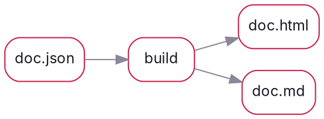
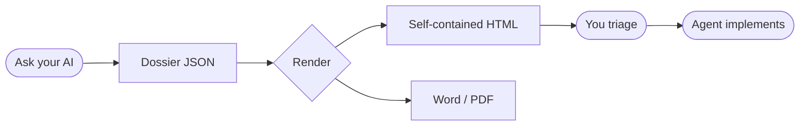

# One JSON file becomes this

Everything below, navigation, search, theme, code, diagrams, charts, math, and an interactive review board, lives in **one self-contained HTML file** with no external assets. The page is a projection of the JSON your AI wrote.

> **Use the full-page toolbar.** In the full HTML artifact, **Edit** changes text in place, the color swatch restyles live in the **Theme Studio**, and **Export** gives you Markdown, JSON, or the agent digest. From the CLI, `dossier export` also writes **Word** (charts and diagrams embedded as images) or **PDF**.

**42** Block types (+5 process blocks) · **0** Runtime deps (view-time network free) · **2** Renderers (Node + React) (same model) · **100%** Self-contained (HTML + source)

### For humans

A navigable, searchable, themeable page, not a wall of Markdown.

### For agents

The full model is embedded as `#dossier-model`; read one block, no scraping.

### For your wiki

One portable file, link it, email it, or `<iframe>` it anywhere.


## Structure & prose

Sections nest other blocks; text fields take inline markdown.

This is a **prose** block with `inline code`, a [link](https://github.com/mrbagels/dossier), and a footnote.[^island]

- Bullet lists render as real lists.
- Inline markdown still works inside list items.

1. Numbered lists work too.
2. Paragraph rhythm stays intact.

A second paragraph to show vertical rhythm.

### How it's built

1. **Author**, An agent writes a `*.dossier.json`.
2. **Validate**, `dossier build` validates and lints.
3. **Render**, JSON becomes HTML + the data island + Markdown.
4. **Use**, Read, decide, export, embed.

### Roadmap

- **0.1** (done), Generator, catalog, features.
- **0.2** (done), MCP, plugins, new blocks.
- **0.5** (done), Process workflows, publishing, embed output, and live editor hooks.

> **Composable.** Sections, two-col, and tabs nest other blocks.

> **Self-contained.** No external fonts, scripts, or images. Works offline.


## Reference blocks

### Code

```ts
import { renderDossier } from "@mrbagels/dossier-react";
const { html, md } = await renderDossier(model); // one self-contained file
```

### Shell

```bash
dossier init my-doc
dossier build my-doc.dossier.json && open my-doc.html
```


### Pipeline



### The loop (Mermaid)



### Exports

| Format | Use |
| --- | --- |
| HTML | The page humans open |
| Markdown | Plain-text copy |
| JSON / digest | What agents read |

| Source | Signal | Use |
| --- | --- | --- |
| Repository | Source + docs | Clone, star, contribute |

### FAQ

**Does it replace my docs site?**

No, it's a companion: linkable, embeddable, exportable artifacts.


## Media & data


## Decisions & trust

### Where it lives

| Option | Cross-project | Public later |
| --- | --- | --- |
| Standalone repo | Yes | One-line flip |
| Inside a monorepo | No | Hard |

### Risks

| Risk | Likelihood | Impact | Mitigation |
| --- | --- | --- | --- |
| Scope creep | medium | medium | Freeze the schema, then build. |

### Try it

- [ ] Install: npm i -g github:mrbagels/dossier
- [ ] Run: dossier init demo && dossier build demo.dossier.json

### Assumptions & open questions

- (assumption/verified) One file beats a folder of assets for sharing.


## Interactive review board, try it

### Navigation (shipped)

Sticky TOC + scroll-spy, search, and a command palette (Cmd/Ctrl-K).

Expand a row, tick the checkbox, leave a note, then **Export JSON**, that decisions packet is what an agent reads back.

- **Shortcut:** Cmd/Ctrl-K

### Themeable (shipped)

Light + dark, per-project token overrides, fully responsive to mobile.

The whole design is a small token system; one accent, near-monochrome neutrals.


## Process board, implementation loop

### Extract a work item (proposed)

Use verdicts and notes to steer actual implementation work.

- **Owner:** agent
- **Priority:** P1
- **Verdict:** undecided
- **Files:** src/generate.mjs, src/runtime/runtime.mjs
- **Verification:** npm test

Pick a verdict, leave notes, then export process JSON. An agent reads that packet with `dossier_read_process` and acts on the accepted work.

```diff
diff --git a/src/generate.mjs b/src/generate.mjs
@@ -1 +1 @@
-// plan-only surface
+// process-aware surface
```

- **Packet:** `dossier.process/v1`
- **Verdicts:** approve, revise, skip, defer, split, retry, block


## Patch set, proposed edits

Implementation dossiers can carry proposed patches grouped by intent, files, work items, risk, and verification.

### Patch process-aware surface

Move the artifact from a plan-only surface to a process-aware one.

- **Operation:** modify
- **Status:** proposed
- **Risk:** low
- **Files:** src/generate.mjs
- **Work items:** extract-work-item
- **Verification:** npm test

```diff
diff --git a/src/generate.mjs b/src/generate.mjs
--- a/src/generate.mjs
+++ b/src/generate.mjs
@@ -1,2 +1,2 @@
-// plan-only surface
+// process-aware surface
```


## Code editor, editable snippet

Small edits can round-trip as `dossier.edits/v1` without turning the artifact into a full IDE.

```js
function exportEdits(state) {
  return { schema: "dossier.edits/v1", edits: state.editors || {} };
}

```


## Diff view, file-first review

A standalone unified diff renders with file summaries, hunks, additions, and deletions.

src/runtime/runtime.mjs (+1/-0)

```diff
diff --git a/src/runtime/runtime.mjs b/src/runtime/runtime.mjs
--- a/src/runtime/runtime.mjs
+++ b/src/runtime/runtime.mjs
@@ -1,3 +1,4 @@
 const state = loadState();
+state.process = state.process || {};
 
 exportProcess(state);
```


## Process closeout blocks

The same artifact now covers implementation, review, integration, release, and incident loops.

## Verification run

### Test suite (passed)

```sh
npm test
```

- **Expected:** All tests pass.
- **Actual:** 17 passing.


## Evidence log

### Build log

- **kind:** command
- **source:** local
- **trust:** high

`npm test` completed successfully.


## Trust report

A provenance layer ties claims to source ids and verification evidence for agent readback.

### Sources

- **npm-test:** npm test (high)
  Local test command recorded in the verification run.
- **manual-qa:** Public manual QA guide (medium)
  Manual browser, live serve, MCP, export, and release gate checklist.

### Claims

- **Automated tests pass for the process block family.** (verified), confidence: high
  - Sources: npm-test
  - Evidence: test-suite
  - Notes: Agents can read this with `dossier_read_trust`.
- **The feature set is ready for public manual QA.** (partial), confidence: medium
  - Sources: manual-qa
  - Evidence: release-checklist
  - Notes: Manual QA still needs a human browser pass before broad announcement.

## Apply gate

Approve, revise, skip, defer, split, retry, or block this process packet.

- **Verdict:** undecided

## Review findings

### Missing evidence link (medium)

Attach the verification run to the work item before closeout.

- **Recommendation:** Link the finding to a `verification-run` id.
- **Files:** src/starters/review.dossier.json


## Review thread

### Agent access

- **Kyle:** Make the packet readable without DOM scraping.
- **Agent:** Use MCP readback and versioned export packets.


## Integration cycles

- **Producer to consumer** (done): Consumer project accepted the packet shape.

## Integration report

- **producer:** dossier
- **consumer:** lumen
- **status:** accepted
- **version:** 0.5.4
- **nextStep:** Dogfood against a live dependency change.
- **Process packets:** Verdicts, releases, edits, and process state all export as structured packets.

## Upstream response

- **upstream:** CodeMirror host adapter
- **status:** tracked
- **request:** Enhance `data-code-editor` hooks in a host runtime.
- **response:** Ready for a hosted adapter without changing the dossier model.
- **nextStep:** Build the adapter in the consuming app.

## Release checklist

- [x] Tests pass (required), npm test
- [x] Docs regenerated (required), README and public manual QA guide refreshed.

## Decision log

- **Keep execution in host tools** (Kyle + Codex): Dossier records state and evidence while CLI, MCP, Lumen, or another host performs filesystem and Git work.

## Process receipt

- **outcome:** functionality closeout ready for public manual QA
- **owner:** Codex
- **date:** 2026-06-29
- **Changed files:** src/generate.mjs, src/runtime/runtime.mjs, schema/packets/trust.schema.json, mcp/server.mjs
- **Commands:** npm test
- **Follow-ups:** Run the public manual QA guide before broad announcement.


### Glossary

- **island**: The embedded `#dossier-model` JSON that is the source of truth for the page.

